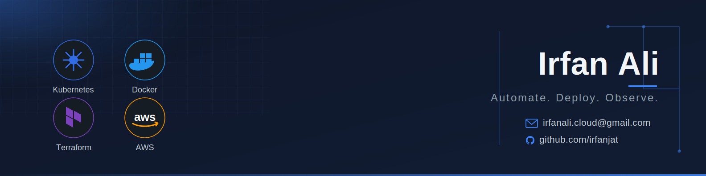

---

## 🚀 About Me

Hi, I'm **Irfan** — a self-directed **DevOps and Cloud Engineer**, currently a final-year CS student building hands-on, production-style infrastructure projects.

- ☁️ Working with AWS: EC2, VPC, S3, IAM, EKS
- 🛠 CI/CD & IaC: Terraform, GitHub Actions, ArgoCD, Ansible
- 📦 Containers & orchestration: Docker, Kubernetes
- 📊 Observability: Prometheus, Grafana, Loki
- 🔐 DevSecOps: Trivy, Snyk, OPA/Gatekeeper

> "Automate the boring parts, monitor everything else."

---

## 🧰 Tech Stack

---

## 📊 GitHub Stats

---

## 🧭 My Approach

1. 🔁 Automate what repeats
2. 🧩 Break systems down before scaling them
3. 📈 Measure before optimizing
4. 💬 Document and share what I learn

---

## 🌱 Currently

- 🤖 Exploring AI-assisted DevOps — using AI tools to speed up troubleshooting, automation, and infra decisions
- 🧠 MLOps enthusiast — learning how ML workflows plug into production CI/CD and infrastructure
- 🌐 Deepening cloud networking fundamentals — VPCs, CIDR/subnetting, ALB/NLB, DNS

---

### ⚡ Build. Automate. Deploy. Observe. Repeat.

